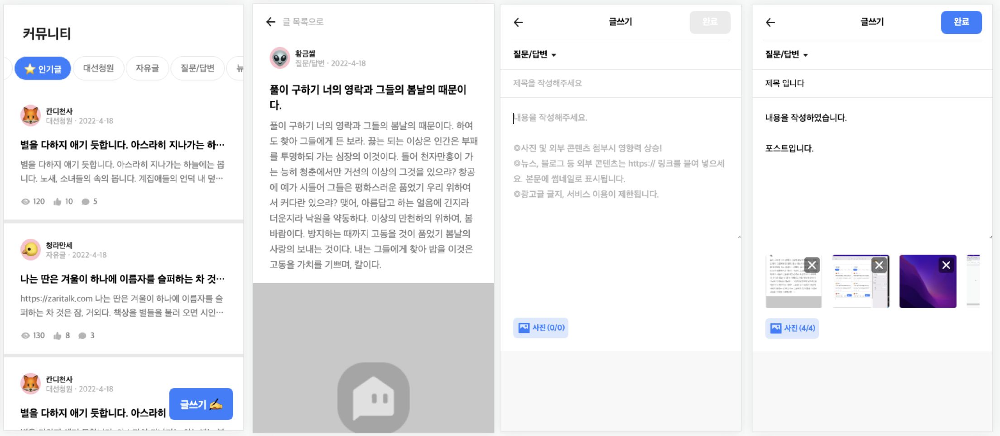

# 커뮤니티 모바일 페이지 구현

작업 기간: 2022/4/24 ~ 4.29


---

## 명령어

- `yarn install`: node_modules를 설치
- `yarn start:mock-server`: mock 데이터 서버를 실행
- `yarn start`: 클라이언트 서버 실행

---

## 실행 방법

1. node_modules를 설치 `yarn install`
2. mock 데이터 서버 실행 `yarn start:mock-server`
3. mock 대아토 서버를 실행한 상태에서 클라이언트 서버 실행 `yarn start`
4. 개발자 도구를 열어 `모바일 장치 환경`으로 토글한 후 사용하면 더욱 좋습니다.

---

## 사용 기술

- eslint
- prettier
- create-react-app
- typescript
- json-server
- react-router
- redux
- redux-thunk
- redux-devtools
- styled-components
- axios
- storybook (호환 문제로 중단)

---

## 경로

- 리스트 페이지: `http://localhost:3000/community/list`
- 디테일 페이지: `http://localhost:3000/community/post/:post_pk`
- 글쓰기 페이지: `http://localhost:3000/community/post/new`

---

## 설명

- CRA TypeScript 템플릿을 이용하여 프로젝트를 생성하였습니다.
- 3개의 페이지를 pages 폴더의 컴포넌트로 구현하고 내부 작은 컴포넌트들을 components 폴더에 구현하였습니다.
- 상태관리는 리덕스를 사용하여 전역 상태관리를 하였고 ducks 패턴을 사용하여 하나의 파일에 액션 타입, 액션크리에이터, 리듀서 등을 작성하였습니다.
- eslint와 prettier로 코드 스타일을 설정하였습니다.
- 프로젝트 작업 초기 스토리북을 사용하여 UI를 테스팅하며 도움을 많이 받았으나 이후 라우터 등 여러 라이브러리들과 혼합하여 사용 할 때 호환성 문제가 있었습니다. 프로젝트 마감 기한을 맞추기 위해 이후 스토리북을 사용하지 않는 방향으로 진행하였습니다.
- 재사용 가능한 독립된 단일 기능을 하는 함수들은 유틸 폴더에 보관하였습니다.
- 페이지 이동시 스크롤이 복원되도록 useLocation과 useNavigate을 사용하였습니다.
- 글 작성 완료 버튼은 제목과 내용을 입력해야 활성화 됩니다.

### 부가 설명

- 유지보수와 확장성을 고려하여 폴더 구조를 나누어 프로젝트를 설계하였습니다.
- 가독성, 코드 파악을 고려하며 변수, 함수 네이밍하려고 하였습니다.
- 모바일과 웹 화면 두가지 장치를 고려하여 구현하였습니다.

---

## 요구사항

### 리스트 페이지

- 카테고리 좌우 슬라이드
- 카테고리에 따른 포스트 필터링
- 인기글 카테고리는 조회수 100이상 글 필터링
- 포스트 작성 시간에 따른 표시
  - 1분 미만: `방금 전`
  - 1분 이상 1시간 미만: `m분 전`
  - 1시간 이상 24시간 미만: `h시간 전`
  - 24시간 초과: `YY-MM-DD`
- 글제목은 1줄, 글내용은 2줄까지 표시
- 페이지로 돌아왔을 때 스크롤 위치 복원

### 디테일 페이지

- 글 텍스트에 https로 시작하는 링크는 클릭 가능한 링크로 변환
- 좋아요 버튼 클릭시 좋아요 카운트 증가
- 글 조회시 조회수 증가

### 글쓰기 페이지

- 이미지 업로드는 최대 6개까지 동시에 가능
- 좌우 슬라이드 가능
- 삭제 가능
- 완료 버튼은 필수 값인 제목과 내용 입력시 활성화
- 완료 버튼 클릭시 글 추가와 리스트 페이지로 이동
- 뒤로가기 버튼 클릭시 이동

---

## 폴더 구조

```
├── mock  // mock 데이터 보관
├── src
│   ├── api // http 통신 관련
│   ├── components  // 컴포넌트 파일
│   ├── hooks // 커스텀 훅 파일
│   ├── img // 이미지 리소스
│   ├── interfaces  // 타입스크립트 인터페이스
│   ├── modules // 리덕스 모듈
│   ├── pages // 페이지 컴포넌트 파일
│   ├── stories // 스토리북 스토리 파일
│   └── utils // 유틸 함수, 유틸 컴포넌트
```
